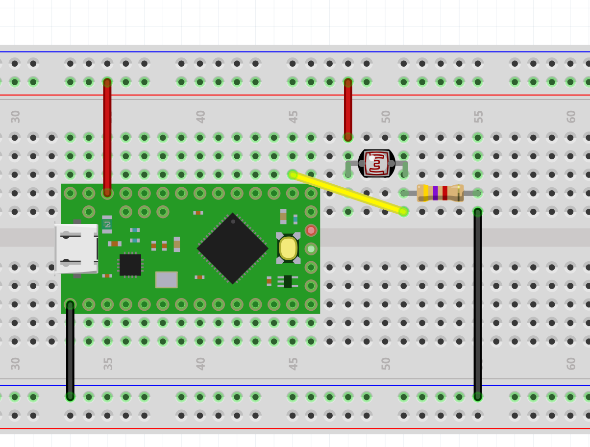

# Control Change with one Analog Input

1) Connect an Analog sensor to the input A0 using a voltage divider

2) Upload the code from this example: https://github.com/ultranoise/teensyMIDItoolkit/blob/master/AnalogControlChange-oneInput/AnalogControlChange-oneInput.ino

3) Create a sonic mapping in your favourite digital synth (like Helm https://tytel.org/helm/, Live Ableton, Reaper, etc).

4) Show it to the class
