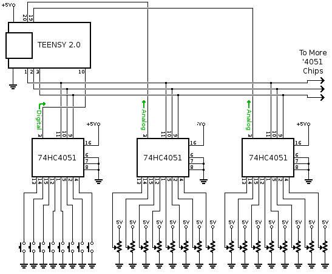

# teensyMIDItoolkit

This repository has been created for helping students to learn the art of USB MIDI.  

You will find examples of arduino code written for teensy boards (especially teensy LC) making it easy to convert your board into a professional MIDI interface using capacitive touch, analog and digital inputs, accelerometers (LIS3DH with I2C), etc.

The examples are organised for practising diverse techniques: buttons to notes, analog sensors to CC, pitch bend and after touch, sequencing... However, this repository contains many more examples than the ones explained at the particular practices specified below (e.g. accel sensors, multiple in/outs, etc). Explore them at your own risk.

To begin with these examples, grasp your teensy board (preferably a teensy LC), install "Teensyduino". For that go to: https://www.pjrc.com/teensy/td_download.html

In Teensyduino, do not forget to select MIDI from the "Tools > USB Type" menu

If you need a MIDI synth to test your code, I recommend Helm (open source & multi-platform): https://tytel.org/helm/

# Practice 1: Control Change with one Analog Sensor
Learn how to create one MIDI Control Change with one Analog Sensor with this tutorial: https://github.com/ultranoise/teensyMIDItoolkit/tree/master/AnalogControlChange-oneInput

# Practice 2: Trigger a MIDI notes and chords with a button
Add one button to the previous project using the following code: https://github.com/ultranoise/teensyMIDItoolkit/tree/master/note-oneButton

# Practice 3: Read capacitive touch input and transmit it as CC, Pitch Bend and After Touch
Add one touch (capacitive) input to the previous project using the following code: https://github.com/ultranoise/teensyMIDItoolkit/tree/master/oneTouch-calibrated

# Practice 4: Create a MIDI Sequencer:
Program a 16-step sequencer with teensy: https://github.com/ultranoise/teensyMIDItoolkit/tree/master/step-sequencer

# To know more
Explore the whole repository of functions available: https://www.pjrc.com/teensy/td_midi.html

Learn more about MIDI here: https://cnx.org/contents/csA1TDZU@4/MIDI-Messages

# Connecting many buttons and knobs 
(source: https://www.pjrc.com/teensy/td_midi.html)
One frequent questions is how to connect multiple buttons and sensors. Often MIDI controllers need more pushbuttons and knobs or sliders than can be connected directly. The inexpensive 74HC4051 or 74HCT4051 chip can be used to connect 8 inputs to one pin. It works for analog or digital signals. Three digital pins are needed to control the 74HC4051, but those same 3 pins can control many chips.  



 To use these 74HC4051 chips, first select the desired channel using the 3 control pins. Then wait a brief time for the signals to propagate through the chips. 50 µs is plenty. Then you can read the pins. This process must be repeated 8 times to read all the signals.

```
  // select 74HC4051 channel 5 (of 0 to 7)
  digitalWrite(1, HIGH);
  digitalWrite(2, LOW);
  digitalWrite(3, HIGH);
  
  // allow 50 us for signals to stablize
  delayMicroseconds(50);
  
  // read the signals routed to pins 10, 19, 20
  // through channel 5 of each 74HC4051 chip
  buttonPin10channel5.update();
  knobPin19channel5 = analogRead(19);
  knobPin20channel5 = analogRead(20);
```

A delay is required between 74HC4051 change and analogRead(). Any extra capacitance can greatly increase the required delay. This forum thread shows how to calculate the delay, and what problems to expect if the delay is not long enough.

For newer Teensy boards with 3.3V signals, 74HCT4051 chips are best. Power the 74HCT4051 from 5V. If 74HC4051 (without the "T") are used, they should be powered by 3.3V when used with a Teensy that has 3.3V signals, or by 5V when used with a Teensy having 5V signals.

# Building a simple MPE controller (in progress)

MIDI MPE Specs: https://d30pueezughrda.cloudfront.net/campaigns/mpe/mpespec.pdf

A common way to describe MPE actions is:

"Strike" Key on intensity / Attack-Velocity

"Press" Aftertouch / Channel Pressure

"Slide" CC 74 (normally vertically)

"Glide" Pitchbend (normally horizontally)

"Lift" Key off intensity / Release-Velocity

Sometimes this also will be referred to as the 5 dimensions of polyphonic expression.

In addition to being able to express per-note pitch (Pitch Bend) and pressure (Channel Pressure), a third dimension of per-note control may be expressed using MIDI CC #74.
