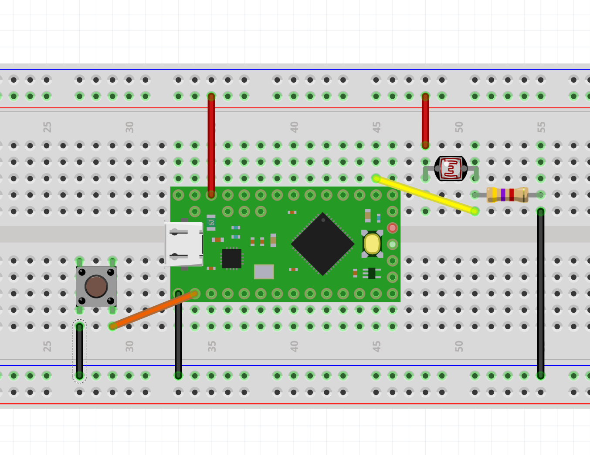

# Add one button for triggering a MIDI notes and chords

1) Add a button in PULL-UP configuration to the circuit

2) First try the code for the button alone: https://github.com/ultranoise/teensyMIDItoolkit/blob/master/note-oneButton/teensy-one-button.ino It will trigger a MIDI note when you press the button. It also releases the note when releasing the button. 

3) Then add this code to the previous code (LDR) so that you now have a Control Change for the LDR and a MIDI note triggered with the Button.

4) Try a sonic mapping with your favourite digital synth.

5) Modify the code to trigger/release a chord instead of a note. 

5) Show it to the class
