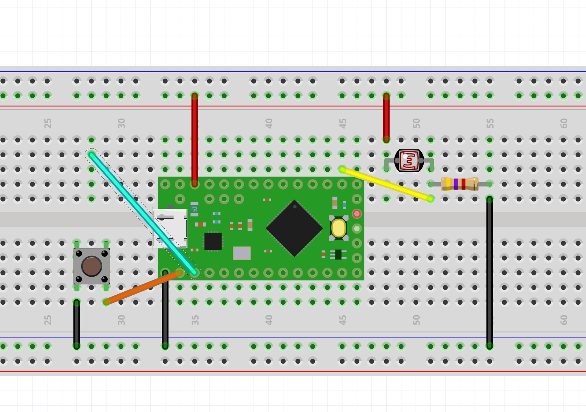

# Read capacitive input, calibrate it and transmit it as MIDI CC and Pitch Bend

1) In this example we will read one capacitive (touch) pin of the Teensy LC. Add a jumper cable (blue in the picture below) to pin 1. You can also physically connect an electrolytic object to the cable (fruits, wood, some plastics, etc)



2) Let´s begin with CC: use the code from this example alone: https://github.com/ultranoise/teensyMIDItoolkit/blob/master/oneTouch-calibrated/teenys-onetouch-calibrated.ino

3) Map it with your favourite synth.

4) Now modify the code for transmiting Pitch Bend instead of CC. For that you will have to use the instruction:

´´´
usbMIDI.sendPitchBend(value, channel); 
``` 

4) Integrate it to the previous code (LDR + button) so that now you have it all using two CC values and a chord trigger. 

5) Map it all with your favourite synth.

6) Show it to the class
